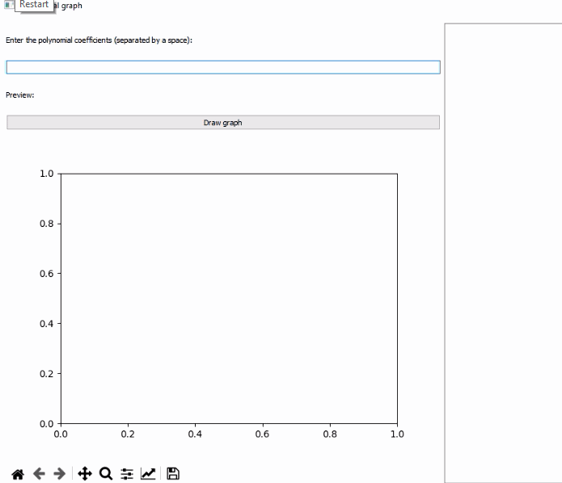
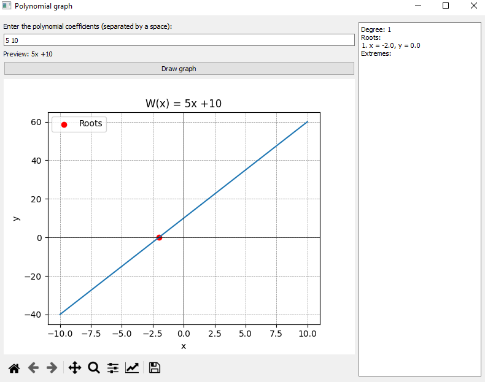
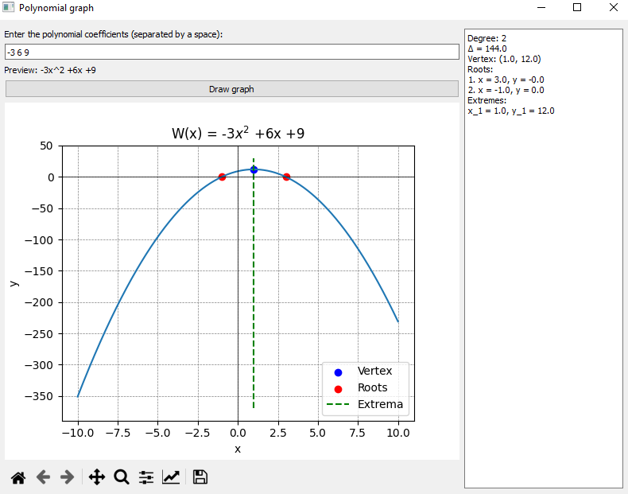
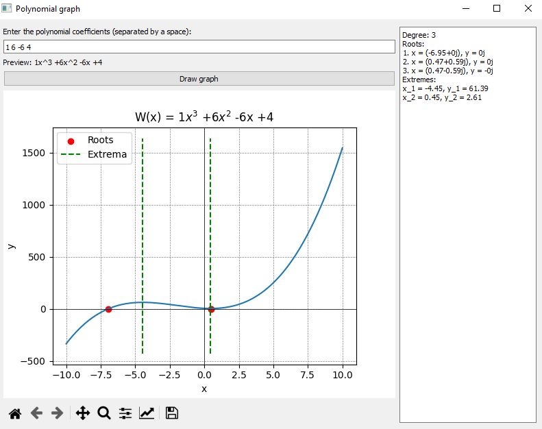
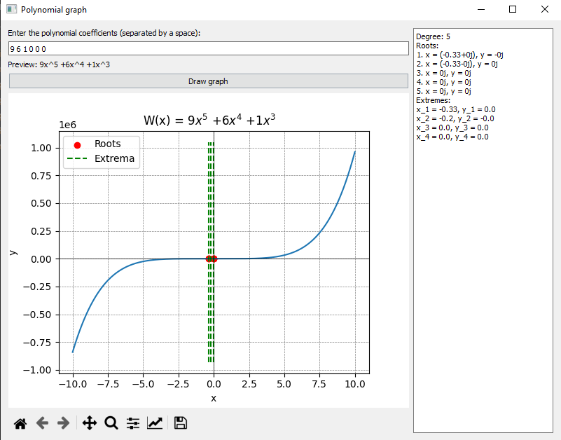

# Polynomial Plotter

A simple polynomial plotter application using PyQt5 and Matplotlib.


## Description

This application allows users to enter polynomial coefficients and visualize the corresponding polynomial graph. It supports quadratic equations, calculates roots, and displays additional information such as the vertex, extrema.
## Features

- Enter polynomial coefficients and visualize the graph.
- Supports quadratic equations with special features.
- Display roots, vertex, extrema information.
- Interactive and user-friendly interface.

## Requirements

Make sure you have the required dependencies installed. You can install them using the following command:

```bash
pip install -r requirements.txt
```

## Usage
1. Install the required dependencies.
2. Run the application using the following command:
```bash
python main.py
```
3. Enter the polynomial coefficients in the provided input field.
4. Click the "Draw graph" button to visualize the polynomial. In the box on the right side lists properties such as degree, elements, extrema of the polynomial.

## Screenshots







